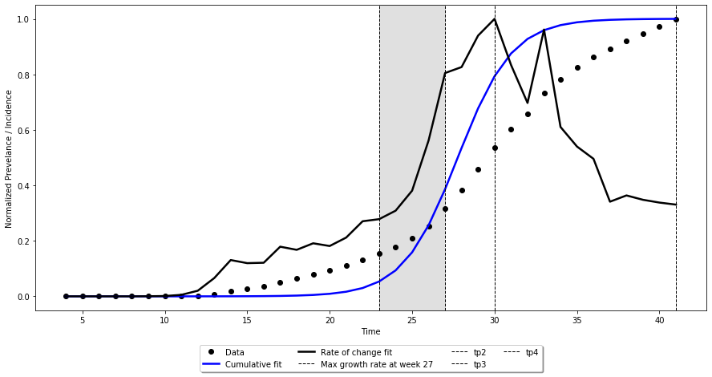

# python_fitVirus
Port of Dr. Batista's single wave fitVirus MATLAB code 
 Reference -- M. Batista (2020). fitVirus (https://www.mathworks.com/matlabcentral/fileexchange/74411-fitvirus), MATLAB Central File Exchange. Retrieved November 2, 2020.

## Version - 8.5
## Date - 12/04/2020
## Author - Azmyin Md. Kamal, Graduate Research Assistant, UL Lafayette, Louisiana, USA

# Images
### Plot with virus phase. Here only the fast-growth phase has been highlighted

## Known Issues ---------------------------------------------------------------------------
<ol>
  <li>check_multiwave is a misnoner, I will fix this later. This code does not check for a 2nd virus wave</li>
</ol>

## Important Notes ---------------------------------------------------------------------------
<ol>
  <li>Number of cases must be cumulative. Sample dataset is in 'week' level but will work for state level and country level dataset</li>
  <li>All values from iniGuessX(C) must be positive values</li>
  <li>New code has to be added to convert X-axis into a different date format i.e. mm/dd/yy</li>
  <li>As long as R2 score is above, 0.97, the model is considered to be fit. This is an emperical observation which needs further investigation</li>
  <li>Color values are in hexadecimal codes. You may use this tool to choose your color https://www.rapidtables.com/web/color/RGB_Color.html </li>
</ol>

## Usage Notes ---------------------------------------------------------------------------------

<ol>
  <li>"funcsXX.py" MUST be in the same folder as the "python_fitvirus.ipynb" notebook</li>
  <li>Requires installation of LMFIT package, installation instruction can be found here: https://lmfit.github.io/lmfit-py/</li>
  <li>cumulative plot's y axis is min-maxed normalized. If you want to see the correct values on y axis, plot cumulative cases and rate of change in cases separately</li>
</ol>

If you find this code useful, please consider citing this repository along with Dr. Batista's original code whose link is given above
